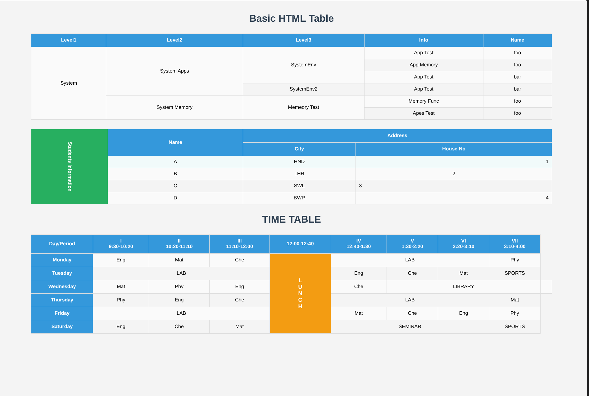

# Basic HTML Table

A beginner-friendly project focused on creating a well-structured HTML table.

## What I Learned
- Structuring tables with `<table>`, `<tr>`, `<th>`, and `<td>`
- Linking external CSS files

## Files
- `index.html` - Table structure
- `basictable.css` - Styling for the table
- `image.png` - Preview of the output

## Preview

