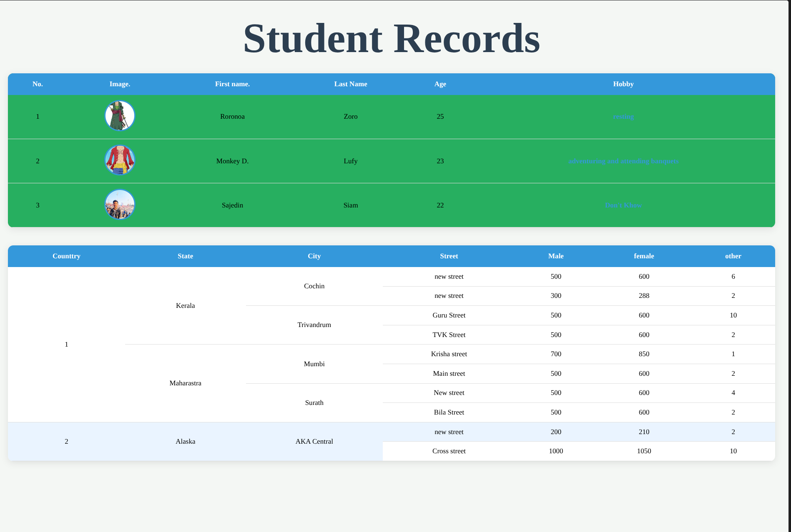

# Student Records Table

A simple student records table created using HTML and CSS.

## What I Learned
- HTML Table
- Table Row, Table Data, Table Header
- CSS Styling (colors, borders, padding, etc.)

## Files
- `index.html` - Table structure
- `style.css` - Styling for the table
- `image.png` - Preview of the output

## Preview
